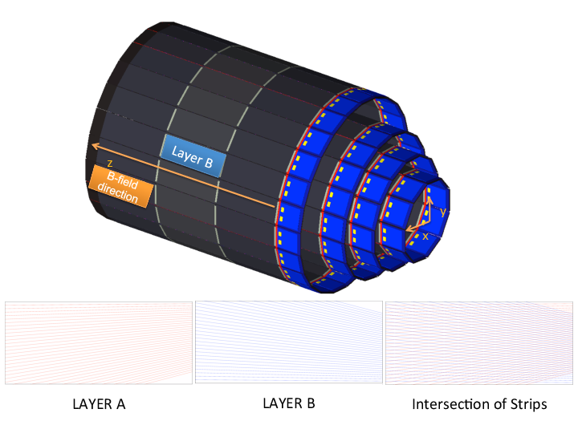
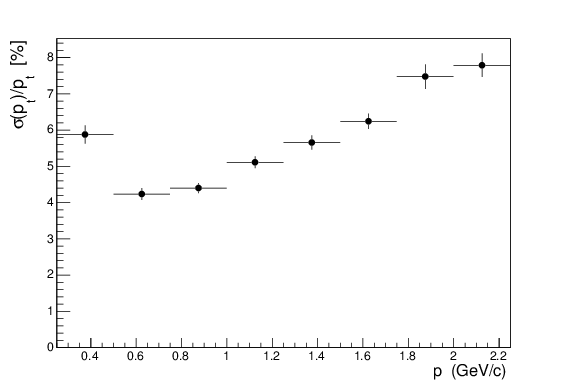
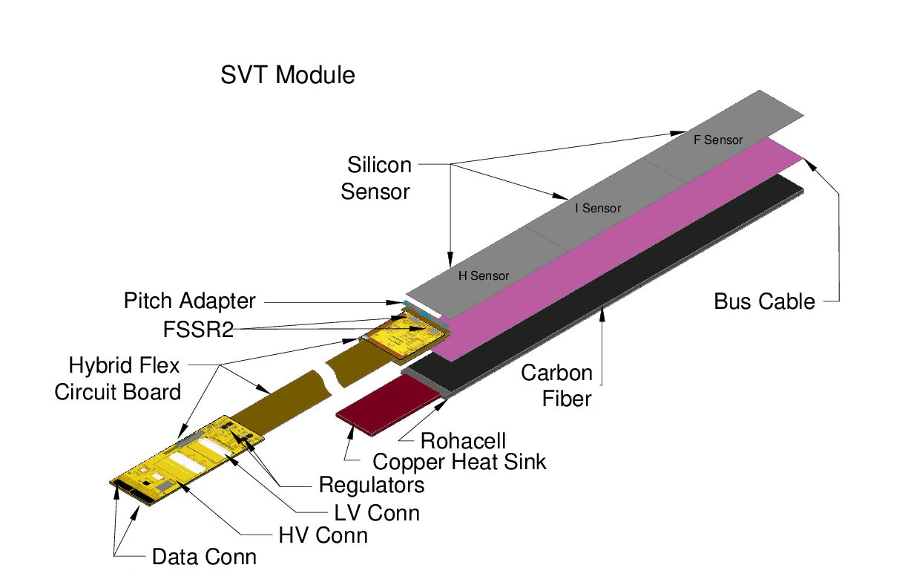
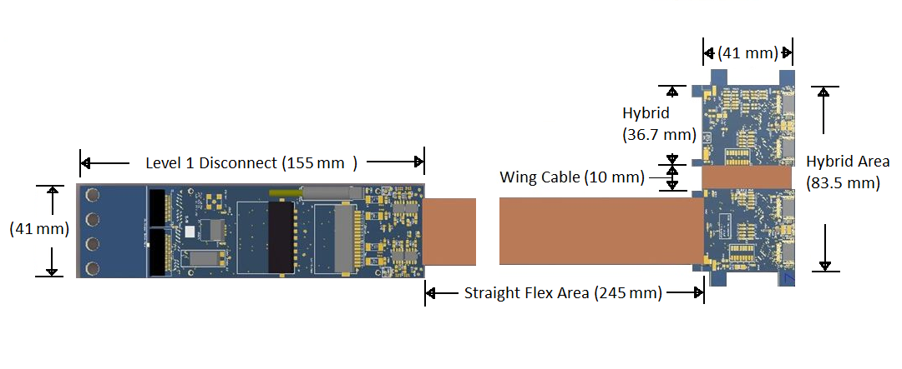
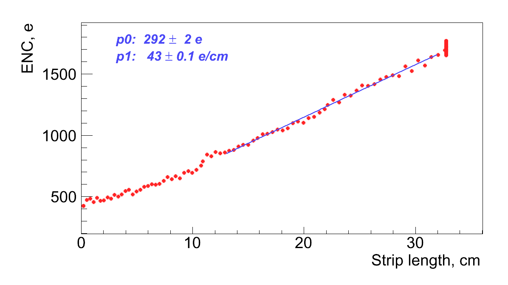

SVT Detector Description
************************

Quick Overview
==============

For the 12 GeV upgrade, the CLAS12 experiment has designed a Silicon Vertex Tracker (SVT) using single sided microstrip sensors fabricated by Hamamatsu. The sensors have graded angle design to minimize dead areas and a readout pitch of 156  |mgr| m, with intermediate strip. Double sided SVT module hosts three daisy-chained sensors on each side with full strip length of 33 cm. There are 512 channels per module read out by four Fermilab Silicon Strip Readout (FSSR2) chips featuring data driven architecture, mounted on a rigid-flex hybrid. Modules are assembled on the barrel using unique cantilevered geometry to minimize amount of material in the tracking volume. 

.. |mgr|  unicode:: U+003BC
   :trim:

Introduction
============

The Continuous Electron Beam Accelerator Facility's (CEBAF) Large Acceptance Spectrometer (CLAS) is being upgraded for the 12 GeV electron beam to conduct spectroscopic studies of excited baryons and of polarized and unpolarized quark distributions, investigations of the influence of nuclear matter on propagating quarks, and measurements of Generalized Parton Distributions (GPDs). Deep exclusive reactions, in which an electron scattering results in a meson-baryon final state, provide stringent requirements for the CLAS12 tracking system. The central tracker consists of a solenoid, Central Time-Of-Flight system (CTOF), and Silicon Vertex Tracker (SVT). The SVT will be centered inside of the solenoid, which has 5 T magnetic field. 

.. image:: images/gpd.jpg

The handbag diagram for deeply virtual Compton scattering (left), and for deeply virtual meson production (right). Four GPDs describe the soft proton structure part. They depend not only on longitudinal momentum fraction x, but on two more variables: the momentum imbalance of the quark before and after the interaction, and the momentum transfer to the proton.

SVT Physics requirements
========================

Essential parts of the physics program, such as GPDs, require tracking of low momentum  particles with few percent momentum and about one degree angle resolution at large angles.. This is achieved by the SVT.  
Silicon detector technology makes an excellent match to the central tracking system in the CLAS12 configuration, small space and high luminosity operation that is needed for accurate measurements of exclusive processes at high momentum transfer.
SVT provides standalone tracking capabilities in the central detector region: 

* Measure recoil baryons and large angle pions, kaons  
* Polar angle |thgr| coverage: :math:`35^\circ-125^\circ`
* Azimuthal angle |phgr| coverage: over 90% of :math:`2\pi`
* Momentum resolution: :math:`\delta p_{T}/p_{T} \le 5\%`
* Angle resolution: :math:`\delta\theta \le` 10 :math:`-` 20 mrad, :math:`\delta\phi \le5` mrad
* Tracking efficiency: :math:`\ge 90\%`
* Match up tracks with hits in the CTOF for :math:`\beta` vs. p measurement (particle ID)

* Stable operation in 5 Tesla magnetic field at instantaneous luminosities :math:`L=10^{35} cm^{-2}s^{-1}`

Expected integrated luminosity per year 500 :math:`fb^{-1}`. Radiation dose for forward sensors (carbon target) is 2.5 Mrads.  

.. |thgr| unicode:: U+003B8
.. |phgr| unicode:: U+003C6
.. |dgr|  unicode:: U+003B4

Detector design and simulation
==============================

The current design of the Barrel Silicon Tracker (BST) comprises 33792 channels of silicon strip sensors in eight layers (four concentric polygonal regions that have 10, 14, 18, and 24 double sided modules mounted back to back). There are three daisy-chained sensors per layer (six per module). Each layer has 256 strips with linearly varying angles of  :math:`0^\circ-3^\circ`. The readout strips have a constant  :math:`\phi` pitch of  :math:`1/85^\circ`

Side view of the SVT detector.

According to the results of JEANT simulation of the SVT, a resolution of 50 :math:`\mu m` in the bending plane is needed to measure, with a precision better than 5%, tracks with momentum up to 1 GeV. Silicon Vertex Tracker uses single sided 320 :math:`\mu m` thick microstrip sensors fabricated by Hamamatsu. The sensors have graded angle design to minimize dead zones and a readout pitch of 156 :math:`\mu m`, with intermediate strip. 

Results of Monte Carlo Simulation for the SVT momentum resolution.

SVT Module
==========

To minimize multiple scattering a unique module design with extra long 33 cm strips has been developed to reduce material budget to 1% of radiation length per region (two silicon planes) for normal incidence tracks, which is essential for low momentum tracking. The SVT modules are cantilevered off a water-chilled cold plate, designed to remove the heat generated by the electronics, located only at one end of the module. Readout electronics is outside of the tracking volume.

Layout of the SVT module.

Double sided SVT module hosts three single sided daisy-chained microstrip sensors fabricated by Hamamatsu on each side. All modules have 3 types of sensors: Hybrid, Intermediate, and Far. Sensors are cut from 6 inch wafers, 2 sensors per wafer. All sensors have the same size, 112 :math:`\times` 42 mm. All SVT modules are identical.

.. image:: images/modulephoto.png

SVT module in the carrier box.

Sensors are mounted on a composite backing structure composed of Rohacell 71 core, bus cable, and carbon fiber. The carbon fiber skin is made from K13C2U fibers oriented in a quasi-isotropic (45/-45/0) pattern. It is co-cured with the bus cable, which is made from a Kapton sheet with 3 :math:`\mu m` thick copper traces, which are 0.5 mm wide; traces on one side provide high voltage to the sensors, on the other side they form a 6 :math:`\times` 6 mm copper mesh over the entire area for grounding the carbon fiber. The Rohacell core under the hybrid board is replaced by a copper heat sink to remove :math:`\sim` 2 W of heat generated by the ASICs. At the downstream end of the module, the Rohacell core is replaced by a polyether ether ketone (PEEK) core. 

Pitch adapter serves to match the 156 :math:`\mu m` sensor readout pitch to the 50 :math:`\mu m` FSSR2 bonding pad pitch. The pitch adapter is a glass plate with metal traces made of an alloy of aluminum and copper. The alloy improves electromigration hardness and bonding. The metal layer is sputter deposited. The passivation layer protects the aluminum traces from damage and is made from :math:`SiO_{2}`. There are 512 channels per module read out by FSSR2 chips, mounted on a hybrid. 

A readout system which instruments both sides of a module with a single rigid-flex Hybrid Flex Circuit Board (HFCB), has been developed by JLAB and fabricated by Compunetics Inc. The HFCB is located on the upstream end of the module. It hosts four FSSR2 ASICs, two on the top and two on the bottom side. The hybrid areas are connected by a 10 mm-long wing cable. Data is transferred from the hybrid via the flex cable to the level one connect (L1C) board. The L1C has two high density Nanonics connectors for data and control lines, Molex Micro-Fit 9-pin connector for high voltage ( :math:`\sim` 85 V) bias to the sensors, and AMP Mini CT 17 pin connector for low voltage (2.5 V) power to the ASICs. There are 12 layers in rigid part and 6 layers in flex part. Control, data, and clock signals do not cross the ground plane splits. Clock signals are located on a separate layer. Guard traces are routed between output, clock, and power lines. Separate planes are provided for analog and digital power. To reduce noise on these planes, regulators and bypass capacitors are added. High voltage filter circuits and the bridging of high and low voltage return lines are located close to the ASICs. Decoupling capacitors for power transmission are placed at transitions between flex and rigid materials.

Hybrid Flex Circuit Board (HFCB).

Readout system
==============

The FSSR2 ASIC has been developed at Fermilab for the BTeV experiment \cite{FSSR}. It was fabricated by Taiwan Semiconductor Manufacturing Company in the 0.25- :math:`\mu m` CMOS process. The chip features a data-driven architecture (self-triggered, time-stamped). Each of the 128 input channels of the FSSR2 ASIC has a preamplifier, a shaper that can adjust the shaping time (50 :math:`-` 125 ns), a baseline restorer (BLR), and a 3-bit ADC. The period of the clock called beam crossing oscillator (BCO) sets the data acquisition time. If a hit is detected in one of the channels, the core logic transmits pulse amplitude, channel number, and time stamp information to the data output interface. The data output interface accepts data transmitted by the core, serializes it, and transmits it to the data acquisition system. To send the 24-bit readout words one, two, four, or six Low Voltage Differential Signal (LVDS) serial data lines can be used. Both edges of the 70 MHz readout clock are used to clock data, resulting in a maximum output data rate of 840 Mb/s. The readout clock is independent of the acquisition clock. Power consumption is \le 4 mW per channel. The FSSR2 is radiation hard up to 5 Mrad. 

Each of the four FSSR2 ASICs reads out 128 channels of analog signals, digitizes and transmits them to a VXS-Segment-Collector-Module (VSCM) card developed at Jefferson Lab. The event builder of the VSCM uses the BCO clock timestamp from the data word of each FSSR2 ASIC and matches it to the timestamp of the global system clock, given by the CLAS trigger. The event builder buffers data received from all FSSR2 ASICs for a programmable latency time up to :math:`\sim` 16 :math:`\mu s`. The VSCM is set up to extract event data within a programmable lookback window of :math:`\sim` 16 :math:`\mu s` relative to the received trigger. The trigger latency is expected to be :math:`\sim` 8 :math:`\mu s`.

Calibration of the readout chain
================================

Since the SVT modules are designed with a binary readout system, the analog channel response cannot be measured directly. Instead, the analog response is reconstructed by injecting a calibration charge on the channel and measuring the corresponding occupancy over a range of threshold values. Noise is measured using external, low frequency calibration charge injected in the absence of signal. The injected charge is shaped and amplified in the analog circuitry to form an output signal. The discriminator threshold determines whether or not the output signal corresponded to a hit. The probability that the injected charge produces a hit depends on the setting of the discriminator threshold. The average hit probability is measured by repeating the process of injecting charges and counting the fraction of readout triggers that produced a hit. This measurement is repeated over a range of threshold settings to produce an occupancy plot. The occupancy plots were measured setting the pulser amplitude at fixed values and changing the comparator thresholds. Each point of an occupancy plot represents the percentage of times that the comparator fires for a certain value of injected charge. In between the high and low threshold regions, the occupancy curve is described by an error function, or S-curve, which can be fitted to the occupancy histogram for each channel, producing a mean value (discriminator threshold) and standard deviation (noise). The conversion from mV to electrons is performed considering a nominal value for the FSSR2 injection capacitance of 40 fF. 

.. image:: images/thrdisp.png

Typical threshold dispersion within a chip.

Threshold dispersion is defined to be a standard deviation of the distribution of means obtained from the parameters of the complementary error function fit. The noise and threshold dispersion constants for each individual detector channel are measured and the values are used by the zero-suppression algorithms implemented in the core logic of the FSSR2 and by calibration procedures to identify defective channels. A comparison of the noise for 33 cm strips with the threshold spread demonstrates that the threshold spread is negligible compared to noise and will not affect efficiency and noise occupancy.

Results of the Full Chain Test
==============================

No significant correlated noise has been observed between the channels of the same chip, between the chips of the same module or between the closely placed modules. Measured average channel noise is comparable with estimated contributions of different noise sources. 

.. image:: images/encmodule.png

Typical input noise on a single chip of an SVT module.

Longer silicon strips have higher capacitance and thus a higher expected value for the input noise. Noise calibration accounts for the different strip lengths and pitch adapter layouts that affect the input capacitance of the preamplifier. 

Noise occupancy histogram with no charge injection is shown below. It probes the tail of the noise distribution, which can show effects masked by the higher occupancy at low thresholds. Channel noise allows setting a 3 :math:`\sigma` threshold at 20 keV level. 

.. image:: images/occ_thr.png

Channel noise occupancy vs. DAC hit/no-hit threshold (in DAC bins, one DAC bin corresponds to 3.5 mV).

SVT module performance meets physics requirements. Module production at Fermilab has been completed in February 2015. Barrel integration and commissioning is in progress. SVT detector will be installed in Hall B in 2016.

Calibration Software
********************

To Run calibration software do:

.. code-block:: bash

   coatjava> bin/run-groovy svt_calibration.groovy

