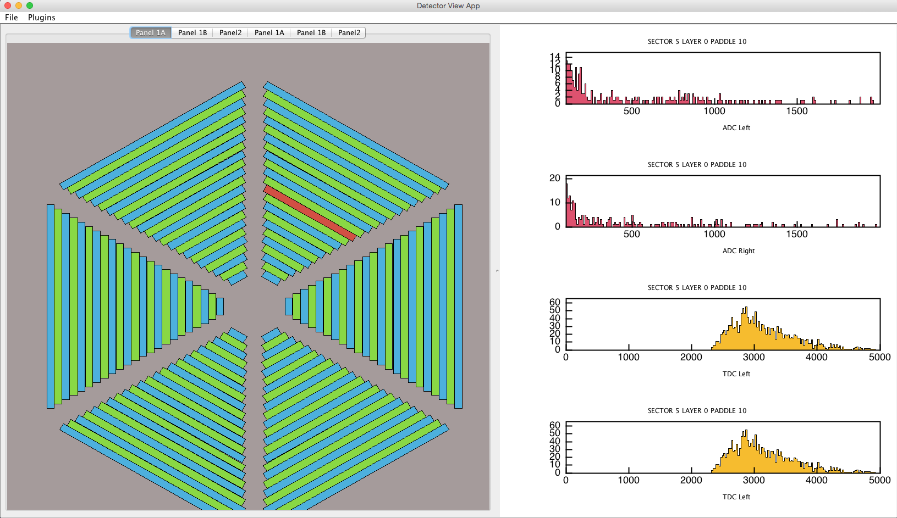

Monitoring and Calibration Software
***********************************

Calibration and Monitoring software for CLAS12 can be implemented as plugins. The pluings
can be loaded by automated GUI which includes a detector view and and has a callback to user plotting 
routine for diplaying plots for various parts of the detector.

Monitoring Class
================

When developing plugins for class software the steps in the documentation should be followed for 
setting up a Maven project with dependencies to include coatjava library package. Then a simple class
extending "DetectorMonitoring" class must be implemented. The compiled package jar file must be copied
into directory "lib/plugins" in coatjava distribution, then run "bin/clas12ui" program.

Here is a complete example of monitoring tool for FTOF detector. 

.. code-block:: java

	package org.jlab.mon.ftof;

	import java.util.TreeMap;
	import org.jlab.clasrec.main.DetectorMonitoring;
	import org.jlab.clasrec.utils.ServiceConfiguration;

	import org.jlab.evio.clas12.EvioDataBank;
	import org.jlab.evio.clas12.EvioDataEvent;
	import org.root.histogram.H1D;
	import org.root.histogram.H2D;
	import org.root.pad.EmbeddedCanvas;

	/**
	 *
 	 * @author gavalian
 	 */
	public class FTOFDetectorMonitoring extends DetectorMonitoring {
    
    private TreeMap<Integer,H2D>  FTOF1A_ADCL = new TreeMap<Integer,H2D>();
    private TreeMap<Integer,H2D>  FTOF1A_TDCL = new TreeMap<Integer,H2D>();
    private TreeMap<Integer,H2D>  FTOF1A_ADCR = new TreeMap<Integer,H2D>();
    private TreeMap<Integer,H2D>  FTOF1A_TDCR = new TreeMap<Integer,H2D>();
    
    public FTOFDetectorMonitoring(){
        super("FTOF","1.0","gavalian");
    }
    
    @Override
    public void processEvent(EvioDataEvent event) {
        if(event.hasBank("FTOF1A::dgtz")==true){
            EvioDataBank bank = (EvioDataBank) event.getBank("FTOF1A::dgtz");
            int nrows = bank.rows();
            for(int row = 0; row < nrows; row++){
                int sector = bank.getInt("sector", row);
                int paddle = bank.getInt("paddle", row);
                int adcL    = bank.getInt("ADCL",   row);
                int tdcL    = bank.getInt("TDCL",   row);
                int adcR    = bank.getInt("ADCR",   row);
                int tdcR    = bank.getInt("TDCL",   row);
                if(FTOF1A_ADCL.containsKey(sector-1)){
                    FTOF1A_ADCL.get(sector-1).fill(paddle, adcL);
                    FTOF1A_TDCL.get(sector-1).fill(paddle, tdcL);
                    FTOF1A_ADCR.get(sector-1).fill(paddle, adcR);
                    FTOF1A_TDCR.get(sector-1).fill(paddle, tdcR);
                }
            }
        }
    }

    @Override
    public void init() {
        for(int loop = 0; loop < 6; loop++){
            FTOF1A_ADCL.put(loop, new H2D("H_S"+loop+"_ADC",23,0,23,200,100.0, 2000.0));
            FTOF1A_TDCL.put(loop, new H2D("H_S"+loop+"_ADC",23,0,23,200,0.0, 5000.0));
            FTOF1A_ADCR.put(loop, new H2D("H_S"+loop+"_ADC",23,0,23,200,100.0, 2000.0));
            FTOF1A_TDCR.put(loop, new H2D("H_S"+loop+"_ADC",23,0,23,200,0.0, 5000.0));
        }
    }

    @Override
    public void configure(ServiceConfiguration sc) {
        
    }

    @Override
    public void analyze() {
        
    }
    
    void drawComponent(int sector, int layer, int component, EmbeddedCanvas canvas){
        System.out.println("Implements Detector Component Draw : " + this.FTOF1A_ADCL.size()
        + " " + this.FTOF1A_TDCL.size());
        String titleString = "SECTOR " + sector + " LAYER " + layer + " PADDLE " + component;
        canvas.divide(4,1);
        if(layer==0){
            if(this.FTOF1A_ADCL.containsKey(sector)==true){
                H1D histADCL = this.FTOF1A_ADCL.get(sector).sliceX(component);
                histADCL.setTitle(titleString);
                histADCL.setXTitle("ADC Left");                
                canvas.cd(0);
                histADCL.setFillColor(6);
                canvas.draw(histADCL);
                
                
                H1D histADCR = this.FTOF1A_ADCR.get(sector).sliceX(component);
                histADCR.setTitle(titleString);
                histADCR.setXTitle("ADC Right");
                canvas.cd(1);
                histADCR.setFillColor(6);
                canvas.draw(histADCR);
                
                H1D histTDCL = this.FTOF1A_TDCL.get(sector).sliceX(component);
                histTDCL.setTitle(titleString);
                histTDCL.setXTitle("TDC Left");
                canvas.cd(2);
                histTDCL.setFillColor(5);
                canvas.draw(histTDCL);
                
                H1D histTDCR = this.FTOF1A_TDCR.get(sector).sliceX(component);
                histTDCR.setTitle(titleString);
                histTDCR.setXTitle("TDC Right");
                canvas.cd(3);
                histTDCL.setFillColor(5);
                canvas.draw(histTDCL);
            }
        }
    }
	}

Running Monitoring GUI
======================

The gui program is included in coatjava distribution. Run the code "bin/clas12ui", then choose "Plugins/Load"
from menu, the plugin list will appear, choose FTOF plugin. Then choose "File/Process File" and choose an EVIO
file to run. The plugin will automatically run all events throu plugin and the drawComponent() method will be
called each time mouse passes over a detector component.
Here is a screenshot of the GUI:

