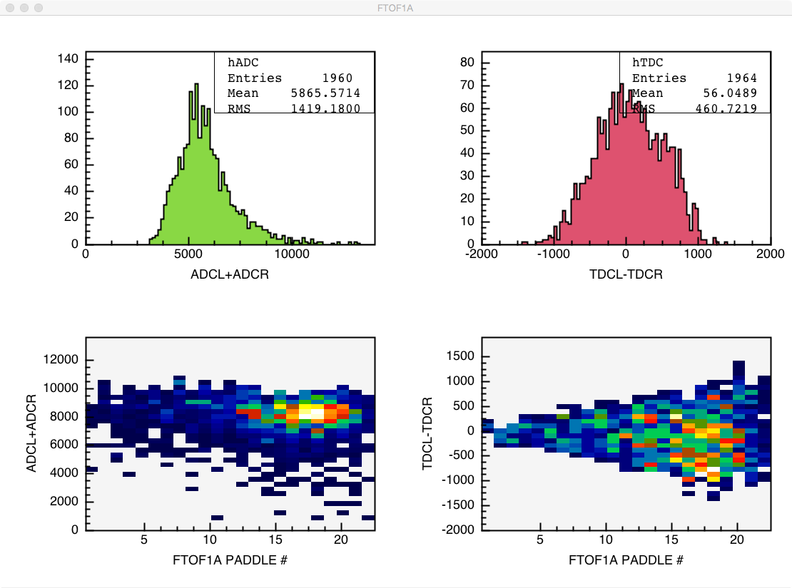

.. _clasio-raw:

Reading Raw data from EVIO
**************************

The clas-io library provides utilities to read/write evio files consistent with CLAS12
conventions. It has classes to manipulate RAW (DAQ) EVIO files as well as GEMC output
EVIO files with dictionary based bank structures.

Introduction
============

There are several modes used in CLAS12 to store raw data. The raw data is stored in composite 
bank structures, where the tag number of the bank represents the CRATE the data is collected 
from then inside there is composite data structure to contain information about SLOT and CHANNEL
followed by the data (typically different for each MODE). MODE=1 refers to raw mode for Flash ADC
pulse where the entire PULSE shape is stored for each CHANNEL. In MODE=3 integrated PULSE information
is stored. 

Reading Raw (DAQ) Files
=======================

Following are examples of groovy scripts used to read evio RAW data files. The examples 
can be found in coatjava package in directory scripts/evio.
To read raw files one must use:

.. code-block:: java

    import org.jlab.evio.clas12.*;
    import org.jlab.clas12.raw.*;
    import org.jlab.evio.decode.*;
    import org.jlab.clas.detector.*;
    import org.jlab.clas12.detector.*;

    outputFile = args[0];

    EvioSource  reader = new EvioSource();
    reader.open(input);
    EventDecoder decoder = new EventDecoder();
    int icounter = 0;
    
    while(reader.hasEvent()){

       icounter++;
       EvioDataEvent event = (EvioDataEvent) reader.getNextEvent();
       System.out.println("---------------> event  # " + icounter);
       decoder.decode(event);
       // The name FTOF1A comes from TRANSLATION TABLE (look below)
       // For other detectors use decoder.getDataEntries("PCAL") for example
       List<DetectorBankEntry> counters =  decoder.getDataEntries("FTOF1A");
       // The entire list of decoded data can be obtained by:
       // List<DetectorBankEntry> counters =  decoder.getDataEntries();
       decoder.getDetectorCounters(DetectorType.FTOF1A);

       for(DetectorBankEntry cnt : counters){
          System.out.println(cnt);
       }
    }
    System.out.println("done...");
    decoder.showTimer();

This script will read each event and print out branches that correspond to crate numbers.
The printout looks like:

.. code-block:: bash

  ----> number of translation tables = 5
  ---> loading translation table [CTOF] : /Users/gavalian/Work/Software/Release-8.0/COATJAVA/coatjava/etc/bankdefs/translation/CTOF.table
  ---> loading translation table [FTOF1A] : /Users/gavalian/Work/Software/Release-8.0/COATJAVA/coatjava/etc/bankdefs/translation/FTOF1A.table
  ---> loading translation table [FTOF1B] : /Users/gavalian/Work/Software/Release-8.0/COATJAVA/coatjava/etc/bankdefs/translation/FTOF1B.table
  ---> loading translation table [PCAL] : /Users/gavalian/Work/Software/Release-8.0/COATJAVA/coatjava/etc/bankdefs/translation/PCAL.table
  ---> loading translation table [SVT] : /Users/gavalian/Work/Software/Release-8.0/COATJAVA/coatjava/etc/bankdefs/translation/SVT.table
  ---------------> event  # 1
  ---------------> event  # 2
  ---------------> event  # 3
  D [FTOF1A ] C/S/C [  11    4   13 ]  S/L/C [   2    1   16 ]  ORDER =    0 -->>>  TYPE = ADCPULSE   SIZE =      100
  D [FTOF1A ] C/S/C [  11    4   15 ]  S/L/C [   2    1   16 ]  ORDER =    1 -->>>  TYPE = ADCPULSE   SIZE =      100
  D [FTOF1A ] C/S/C [  12    3   29 ]  S/L/C [   2    1   16 ]  ORDER =    2 -->>>  TYPE =      TDC  VALUE =    55195
  D [FTOF1A ] C/S/C [  12    3   31 ]  S/L/C [   2    1   16 ]  ORDER =    3 -->>>  TYPE =      TDC  VALUE =    55779
  D [FTOF1A ] C/S/C [  12    3   29 ]  S/L/C [   2    1   16 ]  ORDER =    2 -->>>  TYPE =      TDC  VALUE =    63708
  ---------------> event  # 4
  ---------------> event  # 5
  D [FTOF1A ] C/S/C [  11    5    4 ]  S/L/C [   2    1   21 ]  ORDER =    0 -->>>  TYPE = ADCPULSE   SIZE =      100
  D [FTOF1A ] C/S/C [  11    5    6 ]  S/L/C [   2    1   21 ]  ORDER =    1 -->>>  TYPE = ADCPULSE   SIZE =      100
  D [FTOF1A ] C/S/C [  11    6    1 ]  S/L/C [   2    1   20 ]  ORDER =    0 -->>>  TYPE = ADCPULSE   SIZE =      100
  D [FTOF1A ] C/S/C [  11    6    3 ]  S/L/C [   2    1   20 ]  ORDER =    1 -->>>  TYPE = ADCPULSE   SIZE =      100
  D [FTOF1A ] C/S/C [  12   16    4 ]  S/L/C [   2    1   21 ]  ORDER =    2 -->>>  TYPE =      TDC  VALUE =    57556
  D [FTOF1A ] C/S/C [  12   16   17 ]  S/L/C [   2    1   20 ]  ORDER =    2 -->>>  TYPE =      TDC  VALUE =    57484
  D [FTOF1A ] C/S/C [  12   16    6 ]  S/L/C [   2    1   21 ]  ORDER =    3 -->>>  TYPE =      TDC  VALUE =    57028
  D [FTOF1A ] C/S/C [  12   16   19 ]  S/L/C [   2    1   20 ]  ORDER =    3 -->>>  TYPE =      TDC  VALUE =    56764
  D [FTOF1A ] C/S/C [  12   16   19 ]  S/L/C [   2    1   20 ]  ORDER =    3 -->>>  TYPE =      TDC  VALUE =    64944
  ---------------> event  # 6
  ---------------> event  # 7
  D [FTOF1A ] C/S/C [  11    5    4 ]  S/L/C [   2    1   21 ]  ORDER =    0 -->>>  TYPE = ADCPULSE   SIZE =      100
  D [FTOF1A ] C/S/C [  11    5    6 ]  S/L/C [   2    1   21 ]  ORDER =    1 -->>>  TYPE = ADCPULSE   SIZE =      100
  D [FTOF1A ] C/S/C [  12   16    4 ]  S/L/C [   2    1   21 ]  ORDER =    2 -->>>  TYPE =      TDC  VALUE =    57660
  D [FTOF1A ] C/S/C [  12   16    6 ]  S/L/C [   2    1   21 ]  ORDER =    3 -->>>  TYPE =      TDC  VALUE =    56880
  ---------------> event  # 8
  D [FTOF1A ] C/S/C [  11    3   13 ]  S/L/C [   2    1   15 ]  ORDER =    0 -->>>  TYPE = ADCPULSE   SIZE =      100
  D [FTOF1A ] C/S/C [  11    3   15 ]  S/L/C [   2    1   15 ]  ORDER =    1 -->>>  TYPE = ADCPULSE   SIZE =      100
  D [FTOF1A ] C/S/C [  12    3   13 ]  S/L/C [   2    1   15 ]  ORDER =    2 -->>>  TYPE =      TDC  VALUE =    55024
  D [FTOF1A ] C/S/C [  12    3   15 ]  S/L/C [   2    1   15 ]  ORDER =    3 -->>>  TYPE =      TDC  VALUE =    55759
  D [FTOF1A ] C/S/C [  12    3   13 ]  S/L/C [   2    1   15 ]  ORDER =    2 -->>>  TYPE =      TDC  VALUE =    73541
  D [FTOF1A ] C/S/C [  12    3   13 ]  S/L/C [   2    1   15 ]  ORDER =    2 -->>>  TYPE =      TDC  VALUE =    74658

First lines of printout show the translation tables that have been automatically loaded from the environment. The code
expects the translation tables to be placed in directory "$CLAS12DIR/etc/bankdefs/translation". Every system has to place 
their translation table in the standard directory to automatically load them. The Translation table format is following:

.. code-block:: bash

  #-----------------------------------------------------------------------------
  # TRANSLATION TABLE
  #-----------------------------------------------------------------------------
  # Detector - CRATE - SLOT - CHANNEL - SECTOR - LAYER - COMPONENT - ORDER
  # ORDER 0=ADCL, 1=ADCR, 2=TDCL, 3=TDCR
  #-----------------------------------------------------------------------------
  FTOF1A        5        3        0        1        1        1        0
  FTOF1A        5        3        1        1        1        3        0
  FTOF1A        5        3        2        1        1        1        1
  FTOF1A        5        3        3        1        1        3        1
  FTOF1A        5        3        4        1        1        5        0
  FTOF1A        5        3        5        1        1        7        0
  FTOF1A        5        3        6        1        1        5        1

For detectors with only one ADC and one TDC only entries with ORDER=1 and 3 are appropriate.

Getting decoded data
====================

The printout of the event shows what kind of data is contained in each DetectorBankEntry. If the entry is a 
raw pulse a histogram can be constructed from the pulse:

.. code-block:: java

  if(cnt.getType()==BankType.ADCPULSE){
      H1D hp = EventDecoder.getADCPulse(cnt);
      for(int bin = 0; bin < hp.getxAxis().getNBins();bin++){
          System.out.println(bin + " " + hp.getBinContent(bin));
      }
  }

  if(cnt.getType()==BankType.TDC){
    int[] tdc = (int[]) cnt.getDataObject();
    System.out.println(" TDC VALUE = " + tdc[0]);                     
  }
                 
  if(cnt.getType()==BankType.ADC){
    int[] adc = (int[]) cnt.getDataObject();
    System.out.println(" ADC VALUE = " + adc[0]);
  }
               
  if(cnt.getType()==BankType.ADCFPGA){
    int[] adc = (int[]) cnt.getDataObject();
    int crate = cnt.getDescriptor().getCrate();
    int slot  = cnt.getDescriptor().getSlot();
    int chan  = cnt.getDescriptor().getChannel();
    System.out.println(" PEDISTAL = " + adc[0] 
        + "  PULSE = " + adc[1] 
        + "  MAX   = " + adc[2] 
        + "  TIME  = " + adc[3]); 
  }

Analyzing MODE 7 data
=====================

In mode 7 the ADC pulses are fit with FPGA and four numbers are recorded, pulse integral pulse pedestal,
pulse time and maximum height. The decoder automatically writes pedestal subtracted ADC value into DetectorCounter 
class. Here is a sample code, showing how to analyze data from mode 7.

.. code-block:: java

        String input = "/Users/gavalian/Work/Software/Release-8.0/COATJAVA/FC/sector2_000233_mode7.evio.0";
        EvioSource  reader = new EvioSource();
        reader.open(input);
        EventDecoder decoder = new EventDecoder();
        
        decoder.addFitter(DetectorType.FTOF1A, new FADCBasicFitter(30,35,70,75));
        int icounter = 0;
        H1D hADC = new H1D("hADC",100,0.0,14000.0);
        H1D hTDC = new H1D("hTDC",100,-2000.0,2000.0);
        H2D hADCPADDLE = new H2D("hADCPADDLE",23,0.5,23.5,40,0.0,14000.0);
        H2D hTDCPADDLE = new H2D("hTDCPADDLE",23,0.5,23.5,40,-2000.0,2000.0);
        
        hADC.setLineWidth(2);
        hADC.setFillColor(3);
        hTDC.setLineWidth(2);
        hTDC.setFillColor(6);
        
        hADC.setXTitle("ADCL+ADCR");
        hTDC.setXTitle("TDCL-TDCR");
        hADCPADDLE.setXTitle("FTOF1A PADDLE #");
        hTDCPADDLE.setXTitle("FTOF1A PADDLE #");
        hADCPADDLE.setYTitle("ADCL+ADCR");
        hTDCPADDLE.setYTitle("TDCL-TDCR");
        
        
        while(reader.hasEvent()){
            icounter++;
             EvioDataEvent event = (EvioDataEvent) reader.getNextEvent();
             decoder.decode(event);
             List<DetectorCounter> banks = decoder.getDetectorCounters(DetectorType.FTOF1A);

             for(DetectorCounter bank : banks){
                 if(bank.getChannels().size()==2){
                     if(bank.isMultiHit()==false){
                         // isMultihit() method returns false when
                         //  (bank.getChannels().get(0).getADC().size()==1&&
                         //  bank.getChannels().get(1).getADC().size()==1&&
                         //  bank.getChannels().get(0).getTDC().size()==1&&
                         //  bank.getChannels().get(1).getTDC().size()==1)
                         // it checks if each channel has one ADC and one TDC.
                         int adcL = bank.getChannels().get(0).getADC().get(0);
                         int adcR = bank.getChannels().get(1).getADC().get(0);
                         int tdcL = bank.getChannels().get(0).getTDC().get(0);
                         int tdcR = bank.getChannels().get(1).getTDC().get(0);
                         hADC.fill(adcL+adcR);
                         hTDC.fill(tdcL-tdcR);
                         int sector = bank.getDescriptor().getSector();
                         int layer  = bank.getDescriptor().getLayer();
                         int paddle = bank.getDescriptor().getComponent();
                         hADCPADDLE.fill(paddle, adcL+adcR);
                         hTDCPADDLE.fill(paddle, tdcL-tdcR);
                     }
                 }
             }
        }
        TGCanvas c1 = new TGCanvas("c1","FTOF1A",1200,800,2,2);
        c1.cd(0);
        c1.draw(hADC);
        c1.cd(1);
        c1.draw(hTDC);
        c1.cd(2);
        c1.draw(hADCPADDLE);
        c1.cd(3);
        c1.draw(hTDCPADDLE);

Resulting histograms:

Note, for detectors with only one PMT, there will be one channel present in the DetectorCounter class, 
with corresponding ADC and TDC arrays (it multi-hit).

Analyzing MODE 1 data
=====================

In mode one the entire pulse form is recorded the decoder uses IFADCFitter class to determine ADC value and
record it in the DetectorCounter class. When initializing EvioDecoder class a basic fitter class can be passed to 
the decoder with parameters defining pedestal and pulse integration regions.

.. code-block:: java

        String input = "/Users/gavalian/Work/Software/Release-8.0/COATJAVA/FC/sector2_000233_mode1.evio.0";
        EvioSource  reader = new EvioSource();
        reader.open(input);
        EventDecoder decoder = new EventDecoder();
        
        decoder.addFitter(DetectorType.FTOF1A, 
                new FADCBasicFitter(  30, // first bin for pedestal
                                      35, // last bin for pedestal
                                      70, // first bin for pulse integral
                                      75  // last bin for pulse integral
                                      ));
        while(reader.hasEvent()){
            icounter++;
             EvioDataEvent event = (EvioDataEvent) reader.getNextEvent();
             decoder.decode(event);
             List<DetectorCounter> banks = decoder.getDetectorCounters(DetectorType.FTOF1A);

             for(DetectorCounter bank : banks){
                System.out.println(bank);
             }
        }

Note, the decoder automatically adjusts to the input, and nothing special has to be done when 
reading MODE 1 or MODE 7 data, when MODE 1 data is present the decoder will automatically look
to find a fitter corresponding to given detector, if not found it will printout a warning message
and the resulting DetectorCounter will have no ADC value in any of the channels. When using the decoder
it's a good idea to always add fitter for given detector, if the data is in MODE 7, the fitter will not 
be used.

