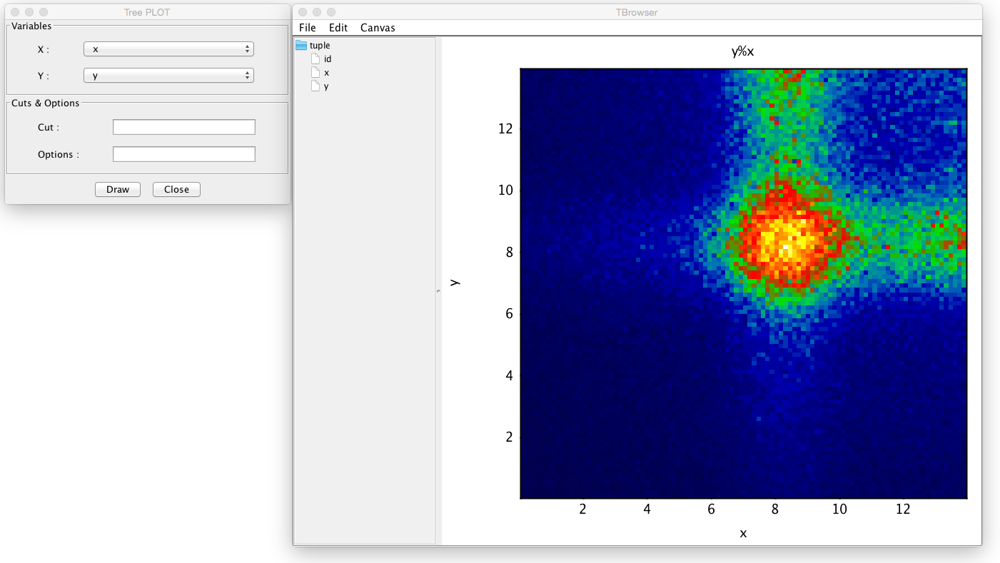
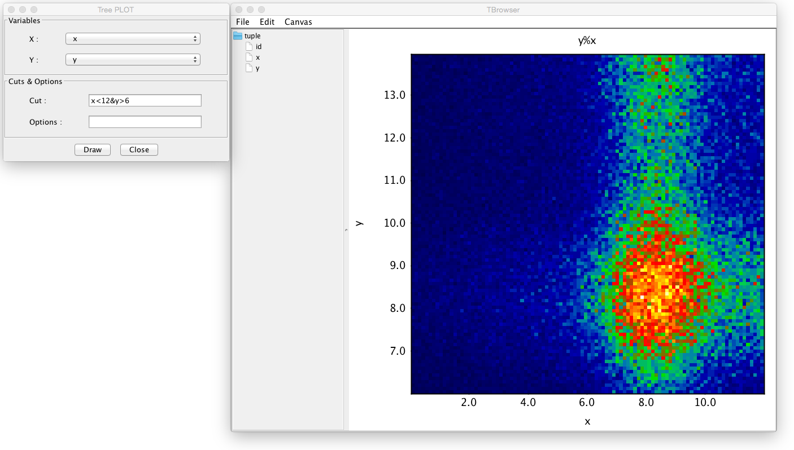

Directories and Trees
*********************

Working with Directories
========================

The histogram package also provides object persistence. Data
objects can be created in groups within a directory which can save
data objects to evio file and read them. Consider example:

.. code-block:: java

   import org.root.group.*;
   import org.root.pad.*;
   import org.root.func.*;
   import org.root.histogram.*;

   TDirectory dir = new TDirectory();

   dir.mkdir("EC/UView/ADC");

   dir.getDirectory("EC/UView/ADC").add(new H1D("PADDLE_1",100,0.0,200.0));
   dir.getDirectory("EC/UView/ADC").add(new H1D("PADDLE_2",100,0.0,200.0));
   dir.getDirectory("EC/UView/ADC").add(new H1D("PADDLE_3",100,0.0,200.0));

   for(int loop = 0; loop < 12000; loop++){
       H1D h1 = (H1D) dir.getDirectory("EC/UView/ADC").getObject("PADDLE_1");
       H1D h2 = (H1D) dir.getDirectory("EC/UView/ADC").getObject("PADDLE_2");
       H1D h3 = (H1D) dir.getDirectory("EC/UView/ADC").getObject("PADDLE_3");
       h1.fill(Math.random()*100.0+50.0);
       h2.fill(Math.random()*140.0+30.0);
       h3.fill(Math.random()*180.0+10.0);
  }

  dir.write("out.evio");

This will create a file containing the histograms in the directory. Following 
code reads the file and displays the content.

.. code-block:: java

   TDirectory dirFile = new TDirectory();
   dirFile.readFile("out.evio");
   dirFile.ls();

The produced output is:

.. code-block:: bash

    DIRECTORY : /
	  EC/UView/ADC
		-> Object : (Name) PADDLE_1                 : (Type) org.root.histogram.H1D
		-> Object : (Name) PADDLE_2                 : (Type) org.root.histogram.H1D
		-> Object : (Name) PADDLE_3                 : (Type) org.root.histogram.H1D

All histogram objects, graphs and functions can be added to the directory.
To draw histograms from a file use:

.. code-block:: java

   TCanvas c1 = new TCanvas("c1","Demo Canvas",600,400);

   H1D h1 = (H1D) dirFile.getDirectory("EC/UView/ADC").getObject("PADDLE_1");
   H1D h2 = (H1D) dirFile.getDirectory("EC/UView/ADC").getObject("PADDLE_2");
   H1D h3 = (H1D) dirFile.getDirectory("EC/UView/ADC").getObject("PADDLE_3");

   h1.setLineWidth(2);
   h1.setLineColor(2);

   h2.setLineWidth(2);
   h2.setLineColor(3);

   h3.setLineWidth(2);
   h3.setLineColor(4);

   h1.setTitle("Random Histogram Demo");
   h1.setXTitle("Random");
   c1.draw(h1);
   c1.draw(h2,"same");
   c1.draw(h3,"same");

The resulting plot will display all three histograms with defined colors on one pad:

.. image:: images/directory-graphs.png

The directory objects can also be browsed using the GUI TBrowser. To use the browser
use script.

.. code-block:: java

   TDirectory dirFile = new TDirectory();
   dirFile.readFile("out.evio");
   dirFile.ls();
   TBrowser browser = new TBrowser(dirFile);

It will open a GUI window with tree representation of given directory. The menu
has items to change the appearance of the canvas, after choosing "Canvas/Split/1x3"
and double clicking on the histogram names in the expanded view of the tree, the canvas
will look like:

.. image:: images/directory-browser.png

Working with NTuples
====================

An NTuple object is a simple tuple with named columns that can be used to plot
variables with given selection into 1D or 2D histograms. The ntuples can be saved into
an EVIO file, and TBrowser object can open tuple tree from EVIO file and from a simple
text file. To produce an NTuple use the following example:

.. code-block:: java

  import org.root.group.*;
  import org.root.func.*;
  import org.root.data.*;
  import org.root.histogram.*;

  F1D f1 = new F1D("gaus+p2",0.0,14.0);
  f1.setParameter(0,120.0);
  f1.setParameter(1,  8.2);
  f1.setParameter(2,  1.2);
  f1.setParameter(3, 24.0);
  f1.setParameter(4,  7.0);
  RandomFunc rndm = new RandomFunc(f1);

  NTuple T = new NTuple("T","id:x:y"); // define ntuple with 3 columns
  double[] vars = new double[3];

  for(int i = 0; i < 340000; i++){
   vars[0] = (double) i;
   vars[1] = rndm.random();
   vars[2] = rndm.random(); 
   T.addRow(vars); // fill ntuple with one row
  }

  T.write("myfirstntuple.evio"); // save to output file
  TBrowser browser = new TBrowser(T); // view in the browser

The saved ntuple file can be opened in the TBrowser by menu "File/Open".
Double clicking the branches of the ntuple will plot the variables into 1D 
histogram. For more plotting options use "Edit/Tree Selector". This will allow
plotting 2D histograms with an option to cut on the variables. Following plot 
shows plotting x vs y variable.

In this plot a condition "x<12&y>6" was applied, shown in the cut input string.
NOTE, single "&" or "|" are used for AND and OR operations.
The 1D histograms are plotted if X and Y are chosen to be the same variable.

To read the ntuple from an EVIO file, an empty ntuple first has to be declared
with some set of variables then variables will be overwritten from the definition
in the file:

.. code-block:: java

  NTuple R = new NTuple("R","a:b");
  R.open("myfirstntuple.evio");
  R.scan(); // prints out variables and values

Here is sample printout from NTuple.scan() function:

.. code-block:: bash

 ***************************************************************************************
 * NTUPLE [                       R]  ENTRIES         339999                           *
 ***************************************************************************************
 *   variable      *            min *            max *           mean *            rms *
 ***************************************************************************************
 *   id            *   0.000000e+00 *   3.399980e+05 *   1.699990e+05 *   9.814926e+04 *
 *   x             *   3.537861e-02 *   1.396500e+01 *   8.470157e+00 *   3.248241e+00 *
 *   y             *   3.507701e-02 *   1.396499e+01 *   8.489932e+00 *   3.240686e+00 *
 ***************************************************************************************

