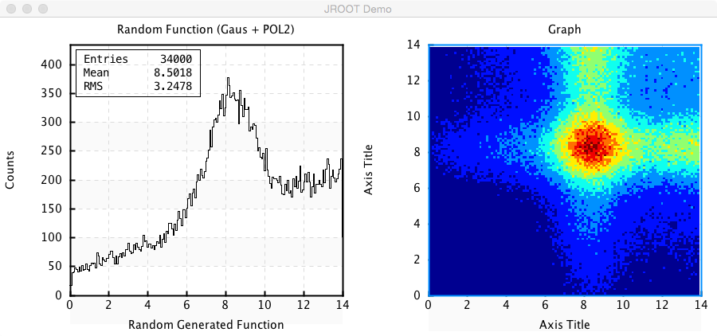
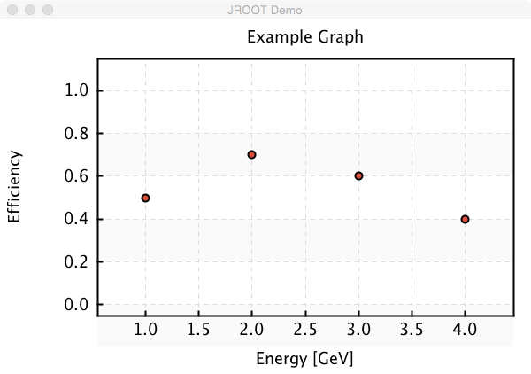
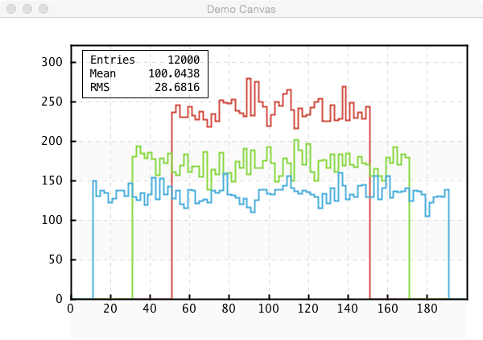
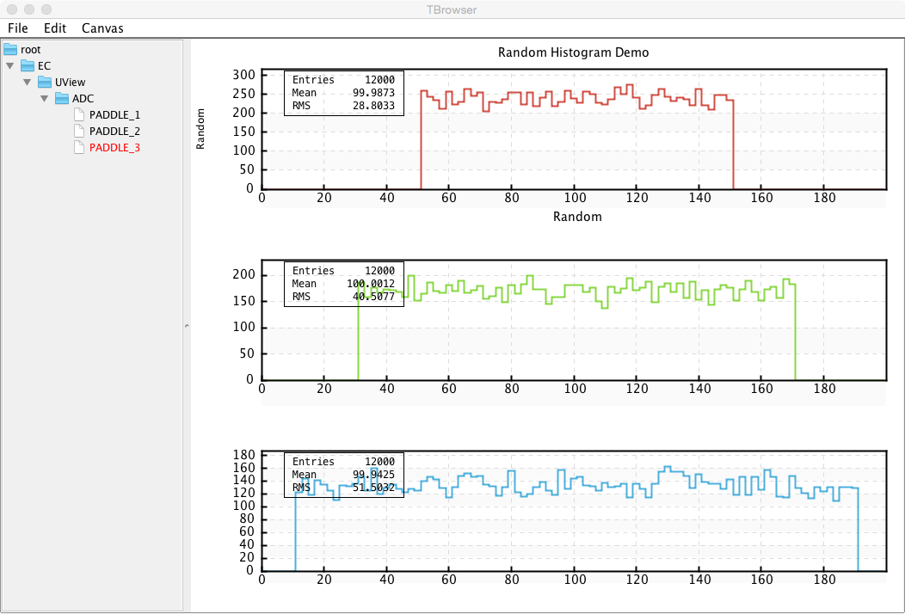

JAVA (COAT) Plotting Package
****************************

Documentation of plaotting package provided within CLAS12 COAT package.

Groovy Scripts
==============

The plotting package can be used within Java program or with groovy scripts.
Install groovy on the system to use scripting support.

Plotting Implementation
=======================

In recent years ROOT has become the most popular scientific plotting package.
Most people know and use ROOT for their data plotting needs. We implemented
the Java plotting library to mimic the root functionality, and have Object 
names and methods same as for ROOT environment. This will make an easy transition
for the users acustomed to ROOT to Java plotting package.

Getting started
===============

The examples of features of plotting package can be found in scripts/jroot directory
of the COATJAVA package. To run examples use:

.. code-block:: bash

   coatjava> bin/run-groovy scripts/jroot/histogramRandom.groovy

This example produces a histogram plot ( 1D and 2D ) for given random function, which
is a gaussian plus 2nd degree polynomial. The plot canvas is fully interactive and
right-click exposes a popup menu with available actions and operations on the available
for given type of a plot.

Creating Canvas
===============

The plotting is done on TCanvas object (same as in ROOT), this simple script will create
an empty canvas with name, title and window size given:

.. code-block:: java

   import org.root.pad.*;
   
   TCanvas c1 = new TCanvas("c1","My Plots",600,600);
   c1.divide(2,2);

The division of canvas can also be specified in the constructor after size parameters.
Once the canvas is created histograms and graphs can be plotted on the canvas. The data
objects in the Java library are named according to ROOT conventions. To create and draw
a GraphErrors object use:

.. code-block::	     java

   import org.root.pad.*;
   import org.root.data.*;

   TCanvas c1 =	new TCanvas("c1","My Plots",600,600);
   c1.divide(1,1);
   int[] x = [ 1.0, 2.0, 3.0, 4.0];
   int[] y = [ 0.5, 0.7, 0.6, 0.4];

   GraphErrors  graph = new GraphErrors(x,y);
   graph.setTitle("Example Graph");
   graph.setXTitle("Energy [GeV]");
   graph.setYTitle("Efficiency");
   c1.cd(0);
   c1.draw(graph);

The resulting plot looks like:

Working with Directories
========================

The histogramming package also provides object persistence. Data
objects can be created in groups within a directory which can save
data objects to evio file and read them. Consider example:

.. code-block:: java

   import org.root.group.*;
   import org.root.pad.*;
   import org.root.func.*;
   import org.root.histogram.*;

   TDirectory dir = new TDirectory();

   dir.mkdir("EC/UView/ADC");

   dir.getDirectory("EC/UView/ADC").add(new H1D("PADDLE_1",100,0.0,200.0));
   dir.getDirectory("EC/UView/ADC").add(new H1D("PADDLE_2",100,0.0,200.0));
   dir.getDirectory("EC/UView/ADC").add(new H1D("PADDLE_3",100,0.0,200.0));

   for(int loop = 0; loop < 12000; loop++){
       H1D h1 = (H1D) dir.getDirectory("EC/UView/ADC").getObject("PADDLE_1");
       H1D h2 = (H1D) dir.getDirectory("EC/UView/ADC").getObject("PADDLE_2");
       H1D h3 = (H1D) dir.getDirectory("EC/UView/ADC").getObject("PADDLE_3");
       h1.fill(Math.random()*100.0+50.0);
       h2.fill(Math.random()*140.0+30.0);
       h3.fill(Math.random()*180.0+10.0);
  }

  dir.write("out.evio");

This will create a file containing the histograms in the directory. Following 
code reads the file and displays the content.

.. code-block:: java

   TDirectory dirFile = new TDirectory();
   dirFile.readFile("out.evio");
   dirFile.ls();

The produced output is:

.. code-block:: bash

    DIRECTORY : /
	  EC/UView/ADC
		-> Object : (Name) PADDLE_1                 : (Type) org.root.histogram.H1D
		-> Object : (Name) PADDLE_2                 : (Type) org.root.histogram.H1D
		-> Object : (Name) PADDLE_3                 : (Type) org.root.histogram.H1D

All histogram objects, graphs and functions can be added to the directory.
To draw histograms from a file use:

.. code-block:: java

   TCanvas c1 = new TCanvas("c1","Demo Canvas",600,400);

   H1D h1 = (H1D) dirFile.getDirectory("EC/UView/ADC").getObject("PADDLE_1");
   H1D h2 = (H1D) dirFile.getDirectory("EC/UView/ADC").getObject("PADDLE_2");
   H1D h3 = (H1D) dirFile.getDirectory("EC/UView/ADC").getObject("PADDLE_3");

   h1.setLineWidth(2);
   h1.setLineColor(2);

   h2.setLineWidth(2);
   h2.setLineColor(3);

   h3.setLineWidth(2);
   h3.setLineColor(4);

   h1.setTitle("Random Histogram Demo");
   h1.setXTitle("Random");
   c1.draw(h1);
   c1.draw(h2,"same");
   c1.draw(h3,"same");

The resulting plot will display all three histograms with defined colors on one pad:

The directory objects can also be browsed using the GUI TBrowser. To use the browser
use script.

.. code-block:: java

   TDirectory dirFile = new TDirectory();
   dirFile.readFile("out.evio");
   dirFile.ls();
   TBrowser browser = new TBrowser(dirFile);

It will open a GUI window with tree representation of given directory. The menu
has items to change the appearance of the canvas, after choosing "Canvas/Split/1x3"
and double clicking on the histogram names in the expanded view of the tree, the canvas
will look like:

